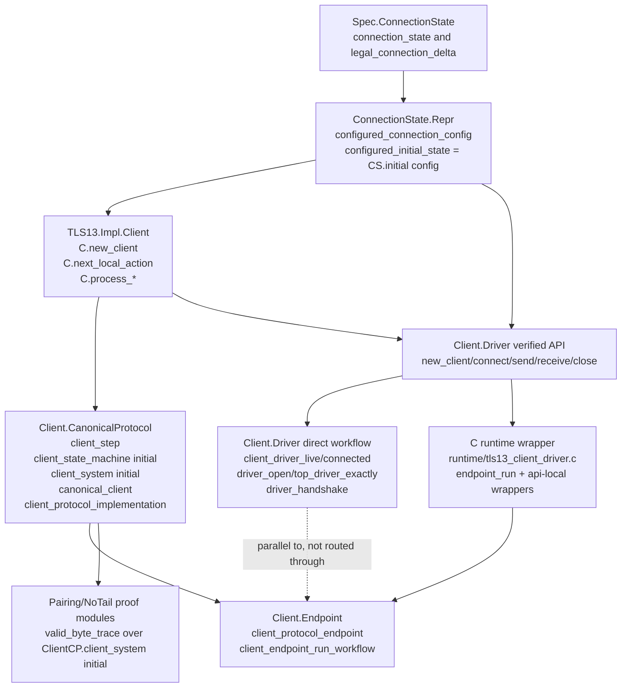
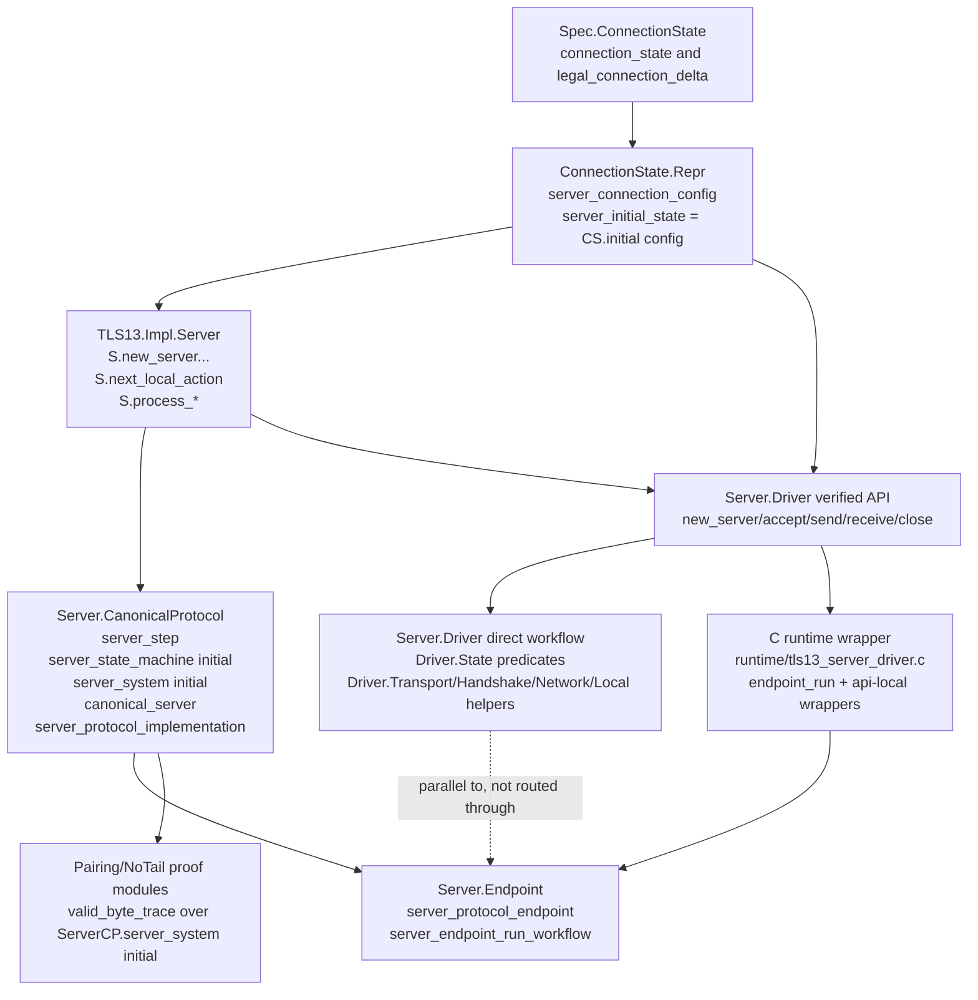
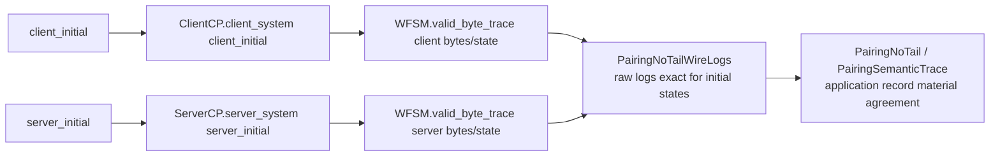
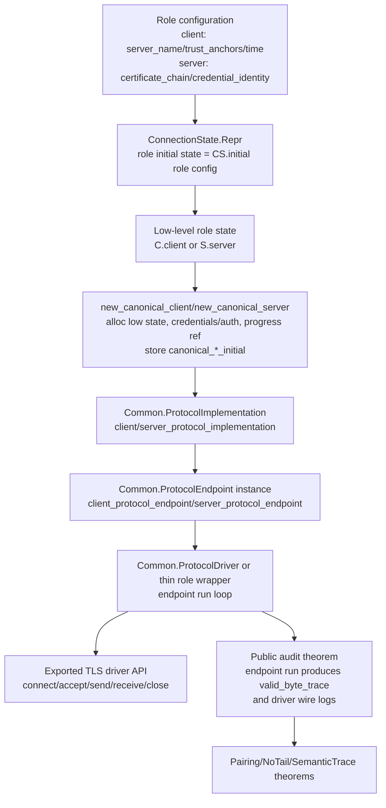

# TLS driver architecture audit

This note describes the current client/server architecture and the remaining
audit gap between the canonical protocol/endpoint layer and the verified driver
modules.  The proof-facing story is organized around
`Common.ProtocolImplementation`, `Common.ProtocolEndpoint`, and valid byte traces
of `Client.CanonicalProtocol.client_system` / `Server.CanonicalProtocol.server_system`.
The extracted C runtime wrappers now execute through the monomorphic endpoint
runners, but the verified `Client.Driver` and `Server.Driver` APIs still expose
role-specific direct workflows.  The cleanest final audit surface would make the
verified public driver ownership predicates canonical-endpoint ownership
predicates too.

## Implementation status

The first cleanup stages are complete:

1. `calc_sample` extraction uses the endpoint canary path.
2. TLS has `new_canonical_client` and `new_canonical_server` constructors that
   package the concrete role state with the canonical initial state and progress
   reference.
3. Client and server canonical invariants derive `WFSM.valid_byte_trace`
   internally from canonical progress and wire-log facts.
4. TLS extraction and the extracted OpenSSL client/server interop tests pass with
   the endpoint modules in the bundle.
5. Client/server network and server local bridge obligations are now derived
   globally from the role specs; canonical/query/endpoint frames no longer carry
   ad-hoc bridge proof fields.
6. Client/server endpoint API-local wrappers now expose the underlying
   `CPI.local_process_correct` fact, so proof-facing driver wrappers can reason
   about endpoint local actions without re-entering the legacy direct-driver
   local-write proofs.

The remaining gap is deliberately narrower: the C-facing runtime wrappers call
`Client.Endpoint.client_endpoint_run_workflow` /
`Server.Endpoint.server_endpoint_run_workflow`, while the verified F* driver
modules still retain the older direct `connect`/`accept` workflows and
`client_driver_live` / `server_driver_live` predicates.

Client-side verified-driver bridge checkpoint: `Client.Driver` now exports
`client_driver_endpoint_config`, `client_driver_endpoint_frame`, and
`client_driver_endpoint_connected`.  The endpoint-owned connected predicate owns
the canonical client invariant, endpoint frame readiness, endpoint IO readiness,
driver channel cell, buffered-length cell, and the existing wire-log accounting.
The legacy public `client_driver_connected` predicate is intentionally unchanged
until the public workflows are routed through endpoint calls.

Server-side verified-driver bridge checkpoint: `Server.Driver.State.server_driver`
now also carries erased canonical progress/initial/supported-profile fields and
exports `server_driver_canonical` plus `server_driver_canonical_progress`, so a
fresh driver can be packaged as the canonical server expected by
`Server.Endpoint`.  It also exposes `server_driver_endpoint_config`,
`server_driver_endpoint_frame`, and `server_driver_endpoint_connected`.  The
server endpoint frame deliberately takes a distinct private-key vec because the
Pulse vec library has no subview ownership that would let the proof split the
64-byte material payload into a 32-byte private-key alias.  The remaining routing
gap is that the public direct `accept`/`send`/`receive`/`close` workflows do not
yet thread or advance that canonical progress resource; the next server stage
must replace those direct workflow predicates with endpoint-owned predicates
before calling `server_endpoint_run_workflow` from verified F*.

## Current client architecture



### What is tied together

- `Client.CanonicalProtocol.client_state_machine initial` sets
  `SM.sm_initial_state = initial`, and `client_system initial` pairs that state
  machine with `CW.tls_record_wire_format`
  (`src/impl/TLS13.Impl.Client.CanonicalProtocol.fst:132-158`).
- `Client.CanonicalProtocol.canonical_client` stores the concrete low-level
  client, a monotonic progress reference, and a ghost
  `canonical_client_initial`.  Its invariant proves
  `WFSM.valid_byte_trace (client_system (Ghost.reveal canonical_client_initial))`
  for the current byte histories and state
  (`src/impl/TLS13.Impl.Client.CanonicalProtocol.fst:230-253`,
  `2672-2748`).
- `Client.CanonicalProtocol.client_protocol_implementation` is the
  `Common.ProtocolImplementation` instance.  Its system is exactly
  `client_system (Ghost.reveal cc.canonical_client_initial)`
  (`src/impl/TLS13.Impl.Client.CanonicalProtocol.fst:3742-3767`).
- `Client.Endpoint.client_protocol_endpoint` instantiates
  `Common.ProtocolEndpoint` for that implementation
  (`src/impl/TLS13.Impl.Client.Endpoint.fst:3064-3095`).  The endpoint layer owns
  scheduling frames, auth buffers, TCP I/O buffers, and a fuel-bounded endpoint
  workflow (`src/impl/TLS13.Impl.Client.Endpoint.fst:31-115`,
  `2632-3062`).
- `Client.CanonicalProtocol.new_canonical_client` now allocates the concrete
  client, the progress reference, and the canonical initial state in one place
  (`src/impl/TLS13.Impl.Client.CanonicalProtocol.fst:3038-3188`).

### What the verified client driver still does directly

The verified `Client.Driver` module still starts from the concrete low-level
client and its own driver resource predicates:

- `CR.configured_initial_state server_name trust_anchors validation_time_seconds`
  is `CS.initial (configured_connection_config ...)`
  (`src/impl/TLS13.Impl.ConnectionState.Repr.fsti:1200-1222`).
- `TLS13.Impl.Client.new_client` allocates a concrete `C.client` at that
  configured initial state (`src/impl/TLS13.Impl.Client.fst:58-168`).
- `TLS13.Impl.Client.Driver.new_client` builds a `client_driver` containing
  `C.client`, `O.auth_context`, channel state, and driver-local buffers; its
  postcondition exposes `client_driver_live result configured_initial_state`
  (`src/impl/TLS13.Impl.Client.Driver.fst:1428-1586`).
- `TLS13.Impl.Client.Driver.connect` opens the TCP channel and then calls the
  direct driver workflow `driver_handshake` through `top_driver_exactly`, not
  `Client.Endpoint.client_protocol_endpoint`
  (`src/impl/TLS13.Impl.Client.Driver.fst:5744-5950`).

The C-facing runtime wrapper is already different: after
`TLS13_Impl_Client_Driver_new_client`, `runtime/tls13_client_driver.c` builds
endpoint frames and calls `TLS13_Impl_Client_Endpoint_client_endpoint_run_workflow`
for `connect`/`receive` and endpoint local-action wrappers for `send`/`close`.
This is extraction-safe because `canonical_client` erases to the same C
representation as the concrete client state.

The result is still two verified client stories:

1. Proof-facing canonical path:
   `canonical_client -> client_protocol_implementation -> client_protocol_endpoint`.
2. Legacy verified driver path:
   `client_driver -> top_driver_exactly -> driver_handshake -> send/receive`.

## Current server architecture



### What is tied together

- `Server.CanonicalProtocol.server_state_machine initial` sets
  `SM.sm_initial_state = initial`, and `server_system initial` pairs that state
  machine with `CW.tls_record_wire_format`
  (`src/impl/TLS13.Impl.Server.CanonicalProtocol.fst:122-148`).
- `Server.CanonicalProtocol.canonical_server` stores the concrete low-level
  server, server credentials, a monotonic progress reference, and
  `canonical_server_initial`.  Its invariant includes the server credential
  relation and the valid-byte-trace witness for
  `server_system (Ghost.reveal canonical_server_initial)`
  (`src/impl/TLS13.Impl.Server.CanonicalProtocol.fst:230-273`,
  `1467-1503`).
- `Server.CanonicalProtocol.server_protocol_implementation` is the
  `Common.ProtocolImplementation` instance, with
  `pi_system srv = server_system (Ghost.reveal srv.canonical_server_initial)`
  (`src/impl/TLS13.Impl.Server.CanonicalProtocol.fst:3500-3525`).
- `Server.Endpoint.server_protocol_endpoint` instantiates
  `Common.ProtocolEndpoint` for that implementation
  (`src/impl/TLS13.Impl.Server.Endpoint.fst:4102-4135`).  The endpoint frame
  carries query state, raw/network buffers, certificate-chain/material buffers,
  and credential-dependent material facts
  (`src/impl/TLS13.Impl.Server.Endpoint.fst:66-120`).
- `Server.CanonicalProtocol.new_canonical_server` now allocates the concrete
  server, credentials, progress reference, supported-profile proof carrier, and
  canonical initial state in one place
  (`src/impl/TLS13.Impl.Server.CanonicalProtocol.fst:1856-1984`).

### What the verified server driver still does directly

The verified `Server.Driver` module also has a separate direct workflow:

- `CR.server_initial_state certificate_chain credential_identity` is
  `CS.initial (server_connection_config certificate_chain credential_identity)`
  (`src/impl/TLS13.Impl.ConnectionState.Repr.fsti:1226-1256`).
- `TLS13.Impl.Server.new_server` and
  `new_server_erased_credential_identity` allocate the concrete server at that
  initial state (`src/impl/TLS13.Impl.Server.fsti:49-131`).
- `TLS13.Impl.Server.Driver` re-exports resource predicates from
  `Server.Driver.State` and builds direct driver state around
  `S.server`, `O.server_credentials`, channel state, and driver-local buffers
  (`src/impl/TLS13.Impl.Server.Driver.fst:48-60`,
  `src/impl/TLS13.Impl.Server.Driver.State.fsti:36-48`).
- `TLS13.Impl.Server.Driver.accept` runs the direct staged workflow
  `accept_start_read_client_hello_select_derive_send_server_hello_drain_empty_once`,
  then uses direct network/local loops such as
  `DN.read_process_network_until_ready` and
  `DL.drain_ready_empty_local_actions` to reach application data
  (`src/impl/TLS13.Impl.Server.Driver.fst:333-670`).

The C-facing runtime wrapper already constructs a canonical-server-shaped value
from the extracted server state and credentials, then calls
`TLS13_Impl_Server_Endpoint_server_endpoint_run_workflow` and endpoint
local-action wrappers.  Unlike the client, the server canonical value retains the
credentials as concrete C data, so the runtime wrapper packages both
`server_driver_server` and `server_driver_credentials`.

So the server has the same split:

1. Proof-facing canonical path:
   `canonical_server -> server_protocol_implementation -> server_protocol_endpoint`.
2. Legacy verified driver path:
   `server_driver -> Driver.State/Transport/Handshake/Network/Local helpers`.

## Current proof-facing pairing path

The pairing proof stack already speaks the canonical-system language:



Examples:

- `PairingValidByteTrace.paired_valid_byte_traces_at_handshake_complete_boundary`
  requires valid byte traces over `ClientCP.client_system client_initial` and
  `ServerCP.server_system server_initial`
  (`src/impl/TLS13.Impl.Driver.PairingValidByteTrace.fsti:15-41`).
- `PairingNoTailWireLogs` inverts valid byte traces for
  `ClientCP.client_system` and `ServerCP.server_system`, then proves the final
  raw wire logs match the serialized trace when the initial state is
  `CS.initial initial.model_config`
  (`src/impl/TLS13.Impl.Driver.PairingNoTailWireLogs.fsti:216-310`).

This is a good proof architecture in isolation.  The weak point is now more
specific: the extracted C runtime follows the endpoint path, but the verified F*
driver predicates do not expose canonical endpoint ownership.  Consequently, an
auditor still has to distinguish the endpoint-centered C path from the older
direct verified driver workflows.

## Architectural gaps and audit risks

1. **Two verified stories.**  The endpoint layer is a generic, uniform executable
   story over `Common.ProtocolImplementation`, but the verified driver APIs still
   expose separate role-specific workflows.  The C runtime has moved to the
   endpoint path; the verified F* driver surface has not.

2. **Canonical implementation values are not the public ownership units.**
   `canonical_client` and `canonical_server` contain exactly the ghost initial
   state and progress evidence that make `pi_system` meaningful, but the exported
   driver predicates expose `client_driver_live/connected` and
   `server_driver_live/connected` instead.

3. **Initial-state choice is duplicated in shape.**  Canonical systems are
   parameterized by a ghost initial state; concrete drivers choose
   `CR.configured_initial_state` or `CR.server_initial_state`.  The connection is
   conceptually clear but not packaged as the public driver invariant.

4. **Scheduler reasoning is fragmented.**  Endpoint modules already encode a
   uniform next-action/action-frame discipline.  Direct drivers encode their own
   client handshake workflow and server accept/local-drain/network-loop workflow,
   so scheduler-sensitive facts have to be audited separately.

5. **Pairing theorems are one layer above the legacy driver predicates.**  The
   clean valid-byte-trace theorems use canonical systems, while legacy top-level
   driver theorems use driver-ready predicates and wire-log predicates.  Without
   endpoint-owned public driver predicates, the audit path from verified driver
   ownership to valid byte traces is still indirect.

## Ideal architecture

The clean architecture should make the endpoint path the only path used by
exported drivers:



In that architecture:

- The public driver owns a canonical implementation value, not a parallel driver
  resource that has to be related later.
- The canonical constructor fixes the initial state once:
  `canonical_client_initial = CR.configured_initial_state ...` or
  `canonical_server_initial = CR.server_initial_state ...`.
- Every network/local step goes through `CPI.pi_process_network` or
  `CPI.pi_process_local` via the endpoint instance.
- The endpoint invariant directly provides the `WFSM.valid_byte_trace` fact for
  the concrete bytes, state, and canonical initial state.
- Role-specific code remains where it belongs: next-action policy, credential
  material preparation, OpenSSL callbacks, and buffer management are endpoint
  frame details, not a second driver semantics.

## Recommended implementation plan

The cleanup should be staged so that the audit surface improves without risking
the extracted C path.  The key rule is: **prove through the generic
`ProtocolImplementation` / `ProtocolEndpoint` classes, but extract through
monomorphic endpoint runners until KaRaMeL has proved it can handle a more
generic driver.**

### 1. Use `calc_sample` as the extraction canary

`calc_sample` already has the same architectural split in miniature:

- `Calc.Server.CanonicalProtocol.new_canonical_server` constructs a canonical
  server and `calc_server_protocol_implementation`.
- `Calc.Server.Endpoint` defines `calc_protocol_endpoint` and a concrete
  endpoint runner.
- The extracted public wrapper
  `Calc.Server.EndpointRunner.run_channel_endpoint` originally called
  `Calc.Server.Socket.run_channel`, the direct socket path, not the endpoint path.

First cleanup target:

1. Change `Calc.Server.EndpointRunner.run_channel_endpoint` to call the concrete
   endpoint runner in `Calc.Server.Endpoint`.  **Done.**
2. Add the endpoint/canonical modules needed by that path to the calc extraction
   target.  **Done.**
3. Run `make -C calc_sample test-c`.  **Done.**
4. Inspect the generated C or add a small Makefile check so the public extracted
   symbol is backed by the endpoint module, not `Calc.Server.Socket.run_channel`.

This is the cheapest place to discover whether endpoint/canonical layering leaks
non-extractable terms into runtime code.

### 2. Keep generic classes proof-only at first

The extraction risk is real: `Common.ProtocolEndpoint.protocol_endpoint` is
`noextract`, and `Common.ProtocolDriver.drive_once` / `drive_steps` are also
`noextract`.  Forcing the public C path to execute through those class records
would require extracting typeclass dictionaries, dependent record fields,
polymorphic generic driver code, and proof-heavy erased arguments all at once.

The safer pattern, already visible in `Calc.Server.Endpoint`, is:

1. Keep `ProtocolImplementation` and `ProtocolEndpoint` instances as proof
   objects.
2. Write monomorphic endpoint runners that call the concrete hooks directly:
   `calc_next_action`, `calc_prepare_network`, `CalcCP.calc_process_network`,
   `calc_finish_network_*`, etc.
3. Use ghost rewrites to show those concrete calls are exactly the corresponding
   typeclass fields.
4. Mark only small concrete helper functions `inline_for_extraction`; leave
   generic proof drivers `noextract`.

This still gives the clean audit story: the proof is stated through the generic
endpoint interface, while the C code contains only first-order, monomorphic
functions.

### 3. Add the TLS canonical constructors

After the calc canary extracts:

1. Add `new_canonical_client`.
   It should allocate `C.new_client`, allocate the client progress reference at
   `CR.configured_initial_state ...`, store that value in
   `canonical_client_initial`, and fold `client_invariant`.  **Done.**
2. Add `new_canonical_server`.
   It should allocate the concrete server and credentials, allocate the server
   progress reference at `CR.server_initial_state ...`, store that value in
   `canonical_server_initial`, and fold `server_invariant`.  **Done.**

These constructors become the single place where the executable initial state is
connected to `client_system initial` / `server_system initial`.

### 4. Wrap public driver ownership around canonical endpoints

The C runtime already performs a first-order endpoint bridge by packaging the
erased canonical values and endpoint frames in C.  The remaining verified-F*
cleanup should introduce endpoint-owned driver predicates that own:

1. the canonical client/server value;
2. the endpoint frame;
3. the TCP channel state;
4. `pe_frame_ready` and `pe_io_ready`;
5. any role-specific auth, credential, app-buffer, and API state needed by the
   existing public API.

Do this as a bridge first, not a deletion.  The old direct driver predicates can
remain internally until the endpoint-owned predicates pass verification and
extraction.  Avoid trying to reuse `client_driver_live` /
`server_driver_live` as-is: those predicates own only `C.connection_exactly` /
`S.connection_exactly`, while endpoint runners require
`CP.client_invariant` / `SP.server_invariant` and their progress references.

### 5. Route client and server public workflows through monomorphic endpoint runners

Port one side at a time:

1. Client `connect` should allocate or own a canonical client and endpoint frame,
   then call the monomorphic `client_endpoint_run_workflow`.
2. Server `accept` should allocate or own a canonical server and endpoint frame,
   then call the monomorphic `server_endpoint_run_workflow`.
3. `send` and `receive` should become thin endpoint steps over an already
   connected canonical endpoint state.

The C runtime already follows this shape.  The verified-F* migration should use
new endpoint-owned driver records or a carefully staged replacement of the
legacy driver records; simply calling the endpoint runner from the existing
legacy predicates is not sound because the canonical progress-resource ownership
is missing.

Do not make this depend on extracting `Common.ProtocolDriver.drive_steps` yet.
If a common driver is desired later, add a separate monomorphized extraction
experiment after the TLS endpoint path is already green.

### 6. Gate every stage on extraction

After each side is ported, run the normal proof and C gates:

1. `make -j128`
2. `make extract-tls13-driver-krml`
3. `make extract-tls13-bundle`
4. the existing extracted client/server OpenSSL tests

If KaRaMeL reports non-Low* code, unresolved polymorphic functions, or missing
class dictionary code, treat that as a design failure in the extractable path:
move the offending value behind `Ghost.erased` / `noextract`, or replace the
generic runtime call with a concrete monomorphic wrapper.

### 7. Export endpoint-derived audit lemmas and retire duplicate workflows

Once the verified public driver ownership predicates use the endpoint path:

1. Export lemmas that connected endpoint-owned client/server states imply
   `WFSM.valid_byte_trace` over the canonical systems.
2. Export no-read-ahead transport-history lemmas that connect TCP histories to
   protocol wire logs.
3. Use those lemmas as the public bridge into the trace-level pairing theorem.
4. Remove or hide direct handshake/accept proof obligations once no exported API
   depends on them.

## Clean audit surface after migration

The final audit should be able to read the system in one line per role:

```text
role configuration
  -> canonical role constructor fixes CS.initial role_config
  -> Common.ProtocolImplementation proves each handler refines role_system initial
  -> Common.ProtocolEndpoint proves executable scheduling/I/O frames preserve the invariant
  -> exported driver runs only this endpoint
  -> valid byte trace + paired transport histories feed the pairing theorem
```

That surface is significantly cleaner than the current one because it removes the
need to compare a direct driver workflow against a separate canonical proof
workflow.  The public theorem stack would then rest on three stable boundaries:

1. Low-level handlers refine `client_step` / `server_step`.
2. Endpoint scheduling and I/O preserve `valid_byte_trace`.
3. Pairing theorems consume canonical valid byte traces and paired transport
   histories.

Everything else becomes role-local implementation detail.
