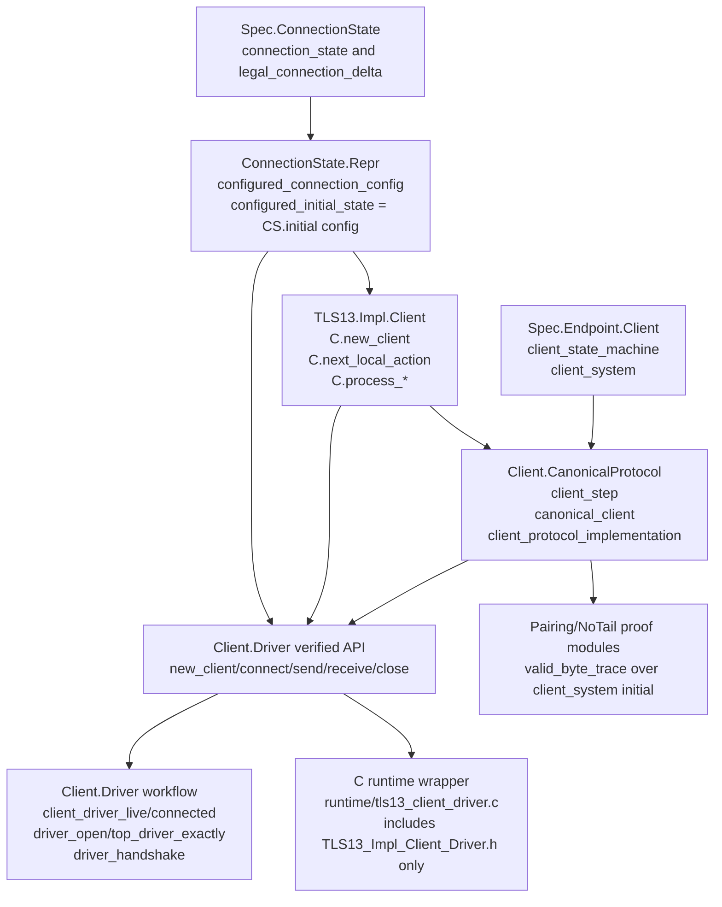
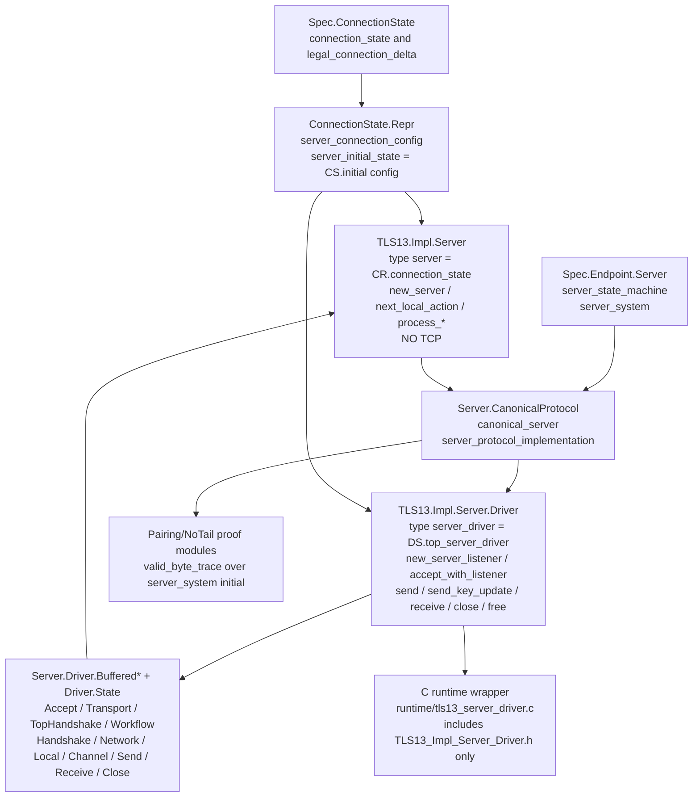
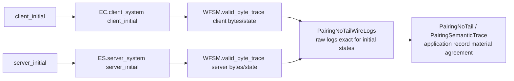
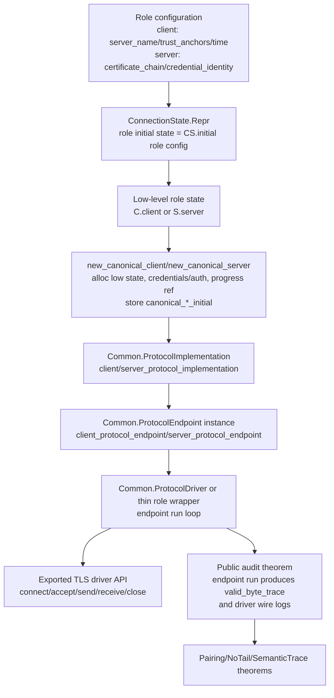

# TLS driver architecture audit

> **Currency note (audited 2026-08-20).**  This document was written while a
> `Common.ProtocolEndpoint` layer -- `TLS13.Impl.Client.Endpoint` (3136 lines)
> and `TLS13.Impl.Server.Endpoint` (4172 lines) -- existed and was described as
> the path the C runtimes executed through.  **Both modules were deleted on
> 2026-07-22 in `712c31c22` "Remove orphaned endpoint APIs."**  The sections
> below have been corrected against the tree; the "Ideal architecture" and
> "Recommended implementation plan" sections are left as-is and flagged, because
> they are proposals that assume that layer.  Anything asserting that a runtime
> calls `*_endpoint_run_workflow` is false: `runtime/tls13_client_driver.c` and
> `runtime/tls13_server_driver.c` each include exactly one extracted header,
> `TLS13_Impl_Client_Driver.h` and `TLS13_Impl_Server_Driver.h` respectively.

This note describes the current client/server architecture.  The proof-facing
story is organized around `Common.ProtocolImplementation` and valid byte traces
of `TLS13.Spec.Endpoint.Client.client_system` /
`TLS13.Spec.Endpoint.Server.server_system` -- both **spec** definitions.  The
extracted C runtime wrappers execute through the verified `Client.Driver` /
`Server.Driver` interfaces, which are the public audit surface.

## Implementation status

> The stages below describe the endpoint-routing cleanup as it stood before
> `712c31c22`.  Stages 1, 4 and 6 refer to endpoint modules that no longer
> exist; stages 2, 3 and 5 describe work that survived the deletion.

The endpoint-routing cleanup stages are complete:

1. `calc_sample` extraction uses the endpoint canary path.
2. TLS has `new_canonical_client` and `new_canonical_server` constructors that
   package the concrete role state with the canonical initial state and progress
   reference.
3. Client and server canonical invariants derive `WFSM.valid_byte_trace`
   internally from canonical progress and wire-log facts.
4. TLS extraction includes the endpoint modules in the driver bundle; final
   extraction and OpenSSL interop gates should be rerun after each routing change.
5. Client/server network and server local bridge obligations are now derived
   globally from the role specs; canonical/query/endpoint frames no longer carry
   ad-hoc bridge proof fields.
6. Client/server endpoint API-local wrappers now expose the underlying
   `CPI.local_process_correct` fact, so proof-facing driver wrappers can reason
   about endpoint local actions without re-entering the legacy direct-driver
   local-write proofs.
7. Client/server proof-facing `send_endpoint`, `receive_endpoint`, and
   `close_endpoint` wrappers now consume and restore the endpoint-owned
   connected predicates around endpoint local actions and endpoint workflow runs.
8. Client `connect_endpoint` and server `accept_endpoint` proof-facing wrappers
   now establish endpoint-owned connected states after the endpoint handshake
   workflow.
9. Endpoint frame construction now uses distinct network and local application
   output buffers, matching the separate ownership required by the canonical
   query resources.

The public F* driver interfaces now match the C-facing runtime shape: workflow
operations route through endpoint-owned `connect_endpoint` / `accept_endpoint`,
`send_endpoint`, `receive_endpoint`, and `close_endpoint` predicates.  The older
direct workflows remain in the implementations only as private compatibility and
proof code.

Client-side verified-driver bridge checkpoint: `Client.Driver` now exports
`client_driver_endpoint_config`, `client_driver_endpoint_frame`, and
`client_driver_endpoint_connected`.  The endpoint-owned connected predicate owns
the canonical client invariant, endpoint frame readiness, endpoint IO readiness,
driver channel cell, buffered-length cell, and the existing wire-log accounting.
The legacy `client_driver_connected` predicate remains private implementation
state; exported workflow specs use `client_driver_endpoint_connected`.

Server-side verified-driver bridge checkpoint: `Server.Driver.State.server_driver`
now also carries erased canonical progress/initial/supported-profile fields and
exports `server_driver_canonical` plus `server_driver_canonical_progress`, so a
fresh driver can be packaged as the canonical server expected by
`Server.Endpoint`.  It also exposes `server_driver_endpoint_config`,
`server_driver_endpoint_frame`, and `server_driver_endpoint_connected`.  The
server endpoint frame deliberately takes a distinct private-key vec because the
Pulse vec library has no subview ownership that would let the proof split the
64-byte material payload into a 32-byte private-key alias.  The server public
workflow surface now uses endpoint-owned predicates; the direct server workflows
remain private implementation code.

## What remains for a single verified and executable path

The committed code now has the intended one-path audit surface for the verified
driver APIs: the exported proof-facing workflow operations consume and restore
endpoint-owned predicates, and the legacy direct workflows have been demoted to
implementation-internal helpers.  The C runtime already calls the endpoint
runners, so the proof-facing public API and executable path now agree on the
endpoint-centered architecture.

The completion target is:

```text
new_client/new_server
  -> canonical driver state with role initial state fixed once
  -> connect/accept produces endpoint-owned connected state
  -> send/receive/close consume and restore endpoint-owned connected state
  -> endpoint-owned connected state exposes canonical valid byte traces
  -> pairing theorem consumes those traces and paired transport histories
```

The implementation milestones are:

| Milestone | Current status | Done when |
| --- | --- | --- |
| Endpoint-owned `send` wrappers | Done; the exported proof-facing send API is `send_endpoint`, which consumes and restores endpoint-owned connected state. | Done. |
| Endpoint-owned `connect`/`accept` | Done; client connect and server accept call the monomorphic endpoint workflow and return endpoint-owned connected predicates. | Done. |
| Endpoint-owned `receive` | Done; the exported proof-facing receive API is `receive_endpoint`, which runs the monomorphic endpoint workflow and restores endpoint-owned connected state. | Done. |
| Endpoint-owned `close` | Done for the endpoint close-notify local action.  The C runtime may optionally follow this with an endpoint workflow wait for the peer close when requested. | Done for the verified close-notify API surface; model the optional wait-for-peer workflow only if the public proof API needs it. |
| Public audit lemmas | Done for the canonical trace bridge: endpoint-owned connected client/server states now expose `WFSM.valid_byte_trace` for the corresponding canonical systems. | Add any remaining transport-history convenience lemmas only if the pairing theorem needs them at the final call site. |
| Retire legacy public workflow surface | Done; direct `connect`/`accept`/`send`/`receive`/`close` specs are no longer exported from the driver interfaces.  Legacy direct helpers remain private implementation code. | Done. |
| Final gates | Pending. | `make -j128`, `make extract-tls13-driver-krml`, `make extract-tls13-bundle`, and extracted OpenSSL tests pass. |

The important audit distinction is now explicit in the interfaces: endpoint-owned
predicates are the exported proof-facing workflow state, while the older
`*_driver_connected` predicates and direct workflows are implementation-internal
compatibility/proof code rather than the public story to audit.

## Current client architecture



### What is tied together

- `Client.CanonicalProtocol.client_state_machine initial` sets
  `SM.sm_initial_state = initial`, and `client_system initial` pairs that state
  machine with `CW.tls_record_wire_format`
  (`src/impl/TLS13.Impl.Client.CanonicalProtocol.fst:132-158`).
- `Client.CanonicalProtocol.canonical_client` stores the concrete low-level
  client, a monotonic progress reference, and a ghost
  `canonical_client_initial`.  Its invariant proves
  `WFSM.valid_byte_trace (client_system (Ghost.reveal canonical_client_initial))`
  for the current byte histories and state
  (`src/impl/TLS13.Impl.Client.CanonicalProtocol.fst:230-253`,
  `2672-2748`).
- `Client.CanonicalProtocol.client_protocol_implementation` is the
  `Common.ProtocolImplementation` instance.  Its system is exactly
  `client_system (Ghost.reveal cc.canonical_client_initial)`
  (`src/impl/TLS13.Impl.Client.CanonicalProtocol.fst:6631`).
- `Client.CanonicalProtocol.new_canonical_client` allocates the concrete
  client, the progress reference, and the canonical initial state in one place
  (`src/impl/TLS13.Impl.Client.CanonicalProtocol.fst:3469`).

> **Superseded (2026-07-22).**  Earlier revisions of this document described a
> separate `Client.Endpoint` layer -- `client_protocol_endpoint` instantiating
> `Common.ProtocolEndpoint`, owning scheduling frames, auth buffers and a
> fuel-bounded endpoint workflow -- and claimed the C runtime called
> `TLS13_Impl_Client_Endpoint_client_endpoint_run_workflow`.  That layer no
> longer exists.  `src/impl/TLS13.Impl.Client.Endpoint.fst` (3136 lines) was
> deleted in `712c31c22` "Remove orphaned endpoint APIs", together with
> `TLS13.Impl.Server.Endpoint.fst`.  `runtime/tls13_client_driver.c` includes
> exactly one extracted header, `TLS13_Impl_Client_Driver.h`, and contains zero
> references to `Client_Endpoint`.  The `ProtocolImplementation` instance
> survived the deletion and is now consumed directly by `Client.Driver`
> (`src/impl/TLS13.Impl.Client.Driver.fst`,
> `src/impl/TLS13.Impl.Client.ChannelImplementation.fst`).

### What the verified client driver still does directly

The verified `Client.Driver` module still starts from the concrete low-level
client and its own driver resource predicates:

- `CR.configured_initial_state server_name trust_anchors validation_time_seconds`
  is `CS.initial (configured_connection_config ...)`
  (`src/impl/TLS13.Impl.ConnectionState.Repr.fsti:1430`).
- `TLS13.Impl.Client.new_client` allocates a concrete `C.client` at that
  configured initial state (`src/impl/TLS13.Impl.Client.fst:1440`).
- `TLS13.Impl.Client.Driver.new_client_with_auth_config` builds a
  `client_driver` containing `C.client`, `O.auth_context`, channel state, and
  driver-local buffers (`src/impl/TLS13.Impl.Client.Driver.fsti:133`).
- `TLS13.Impl.Client.Driver.connect` opens the TCP channel and then runs the
  driver workflow through `top_driver_exactly`
  (`src/impl/TLS13.Impl.Client.Driver.fsti:273`).

So there is now **one** verified client path, not two: the endpoint
alternative was deleted rather than kept in parallel.

`client_driver -> top_driver_exactly -> driver_handshake -> send/receive`,
with `canonical_client` / `client_protocol_implementation` supplying the
proof-facing system that the driver's invariant refers to.

## Current server architecture



### The two layers, and which is which

`TLS13.Impl.Server` is the **protocol-step layer**.  `type server =
CR.connection_state` (`src/impl/TLS13.Impl.Server.fsti:42`).  Its entire
exported API is a family of `process_*` functions -- `process_client_hello`,
`process_send_server_hello`, `process_derive_shared_secret`,
`process_install_client_handshake_read_keys`, `process_verify_client_finished`,
`process_local_event`, `process_network_bytes`, and about thirty more -- each
one verified single transition of the connection state.  It performs **no
I/O**: `Common.TCP` and `Common.BufferedTCP` appear zero times in both
`TLS13.Impl.Server.fst` and `.fsti`.  On its own it cannot run a connection.

`TLS13.Impl.Server.Driver` is the **transport and lifecycle layer**.  `type
server_driver = DS.top_server_driver`, and its exported API is
`new_server_listener`, `free_server_listener`, `new_server_credentials`,
`free_server_credentials`, `new_server_with_credentials`,
`accept_with_listener`, `send`, `send_key_update`, `receive`, `close`, `free`
(`src/impl/TLS13.Impl.Server.Driver.fsti:237-510`).  All socket I/O lives here
and in the `Buffered*` submodules.

The relationship is **containment, not specialisation**: the driver record has
the step-layer server as a field.

```fstar
noeq type top_server_driver = {
  top_server_driver_server: S.server;              // S = TLS13.Impl.Server
  top_server_driver_credentials: O.server_credentials;
  top_server_driver_channel: Box.box (option BT.t); // BT = Common.BufferedTCP
  ... output and scratch vectors ...
  top_server_driver_progress: MR.mref (ES.server_progress_preorder ...);
  top_server_driver_tcp_history: MR.mref CI.io_history_preorder;
  top_server_driver_initial: Ghost.erased ES.server_initial_state;
  top_server_driver_supported_profile: Ghost.erased (SP.server_supported_profile_proof ...);
}
```

(`src/impl/TLS13.Impl.Server.Driver.State.fsti:89-110`.)  The two monotonic
ghost references are what let the driver state a *temporal* property the step
layer cannot: that the steps it performed form a legal server trace and that
what went on the wire agrees with it.  That is
`Server.Driver.server_driver_canonical : SP.canonical_server` and
`server_driver_canonical_progress`
(`src/impl/TLS13.Impl.Server.Driver.fsti:37,42`).

Dependency runs strictly one way.  Twelve modules abbreviate
`TLS13.Impl.Server`, and every one of them is in the `Driver.*` tree or in
`CanonicalProtocol`/`CanonicalQueries`; nothing in `TLS13.Impl.Server`
mentions the driver.

### The real call chain

`accept_with_listener` is the entry point, and it delegates immediately:

```
Driver.accept_with_listener                  (Driver.fst:176, fsti:336)
  -> BufferedAccept.run                      (BufferedAccept.fst:32)
       -> BufferedTransport.accept_transport_once_from     TCP accept
       -> BufferedTopHandshake.run_connected (BufferedTopHandshake.fst:18)
            -> BufferedWorkflow.run          (BufferedWorkflow.fst:498)
                 -> BufferedHandshake.select_derive_send_server_hello_from_payload_once
                 -> BufferedLocal.process_ready_empty_local_action_once
                 -> BufferedNetwork.drive    (BufferedNetwork.fst:1670)
                      -> S.process_*         the step layer
       -> BufferedChannel.pack_connected_channel
```

The calls that actually cross the layer boundary are
`S.process_network_bytes`, `S.process_local_event_with_credentials`,
`S.process_select_default_server_parameters_with_derived_public_from_private_array`,
`S.process_send_server_hello_with_derived_public_from_private_array` and
`S.process_derive_shared_secret_from_private_array`.

### A naming trap

`TLS13.Impl.Server.Network` and `TLS13.Impl.Server.Driver.Network` /
`Driver.BufferedNetwork` are not variants of one another:

- `Impl.Server.Network` is step-layer.  It exports `process_client_hello`,
  `process_client_finished`, `process_network_bytes`, and requires the record
  fragment to be *exactly* the serialized message
  (`src/impl/TLS13.Impl.Server.Network.fsti:30,110,160`).
- `Driver.BufferedNetwork` is driver-layer.  It exports `drive` and owns
  `decode_network_buffer`, which can return `NetworkBufferNeedMoreInput` so the
  driver retries against a retained buffer.

That boundary is exactly where gap G3 sits.  TCP short reads are absorbed by
the driver's retry loop -- the `tcp-dribble` cells pass -- while one handshake
message spread over two *records* is refused, because the step layer's
precondition is message-exact.  See `docs/server-client-parity.md`.

### What is tied together

- `server_state_machine` and `server_system` are defined in the **spec**, not
  in the implementation: `src/spec/core/TLS13.Spec.Endpoint.Server.fst:199` and
  `:215`.
- `Server.CanonicalProtocol.canonical_server` stores the concrete low-level
  server, server credentials, a monotonic progress reference, and
  `canonical_server_initial`.  Its invariant includes the server credential
  relation and the valid-byte-trace witness for
  `server_system (Ghost.reveal canonical_server_initial)`
  (`src/impl/TLS13.Impl.Server.CanonicalProtocol.fst:175`).
- `Server.CanonicalProtocol.server_protocol_implementation` is the
  `Common.ProtocolImplementation` instance
  (`src/impl/TLS13.Impl.Server.CanonicalProtocol.fst:6967`).  It is consumed
  directly by `Server.Driver` and `Server.ChannelImplementation`.
- `Server.CanonicalProtocol.new_canonical_server` allocates the concrete
  server, credentials, progress reference, supported-profile proof carrier, and
  canonical initial state in one place
  (`src/impl/TLS13.Impl.Server.CanonicalProtocol.fst:1811`).
- `CR.server_initial_state certificate_chain credential_identity` is
  `CS.initial (server_connection_config certificate_chain credential_identity)`
  (`src/impl/TLS13.Impl.ConnectionState.Repr.fsti:1471`).
- `TLS13.Impl.Server.new_server` and `new_server_erased_credential_identity`
  allocate the concrete server at that initial state
  (`src/impl/TLS13.Impl.Server.fsti:61,115`).

> **Superseded (2026-07-22).**  Earlier revisions of this document described a
> `Server.Endpoint` layer (`server_protocol_endpoint`,
> `server_endpoint_run_workflow`) sitting between `CanonicalProtocol` and the
> runtime, and described the server as having "the same split" as the client
> between a proof-facing endpoint path and a legacy direct driver path.  Both
> claims are obsolete.  `src/impl/TLS13.Impl.Server.Endpoint.fst` (4172 lines)
> was deleted in `712c31c22` "Remove orphaned endpoint APIs", and
> `runtime/tls13_server_driver.c` includes exactly one extracted header,
> `TLS13_Impl_Server_Driver.h`.  The step layer is reachable from C only
> through the driver.  Earlier revisions also named driver helpers
> `accept`, `accept_start_read_client_hello_select_derive_send_server_hello_drain_empty_once`
> and `read_process_network_until_ready`, none of which exist; the current
> chain is the one listed above.

So there is one verified server path, not two:
`server_driver -> Driver.State + Buffered* helpers -> TLS13.Impl.Server.process_*`,
with `canonical_server` / `server_protocol_implementation` supplying the
proof-facing system that the driver's invariant refers to.

## Current proof-facing pairing path

The pairing proof stack already speaks the canonical-system language.  Note the
qualification: `client_system` and `server_system` are **spec** definitions
(`EC = TLS13.Spec.Endpoint.Client:348`, `ES = TLS13.Spec.Endpoint.Server:215`),
not implementation ones -- earlier revisions of this document attributed them to
`Client.CanonicalProtocol`/`Server.CanonicalProtocol`, which is where the
pairing modules consume them but not where they are defined.



Examples:

- `PairingNoTailWireLogs.lemma_client_valid_byte_trace_inverts_to_serialized_trace`
  and its `lemma_server_...` counterpart require valid byte traces over
  `EC.client_system client_initial` and `ES.server_system server_initial`
  (`src/impl/TLS13.Impl.Driver.PairingNoTailWireLogs.fsti:219,255`).  An earlier
  revision cited
  `PairingValidByteTrace.paired_valid_byte_traces_at_handshake_complete_boundary`;
  that module was removed in `a8b9dcf81` "Use generated TLS wire codecs" and the
  theorem name no longer occurs anywhere in `src/`.
- `PairingNoTailWireLogs` inverts valid byte traces for
  `EC.client_system` and `ES.server_system`, then proves the final
  raw wire logs match the serialized trace when the initial state is
  `CS.initial initial.model_config`
  (`src/impl/TLS13.Impl.Driver.PairingNoTailWireLogs.fsti:216-310`).

This is a good proof architecture in isolation.  The weak point described in
earlier revisions -- "the extracted C runtime follows the endpoint path, but the
verified F* driver predicates do not expose canonical endpoint ownership", so an
auditor must distinguish the endpoint-centered C path from the direct driver
workflows -- **no longer applies**, because the endpoint path was deleted rather
than reconciled (`712c31c22`).  Both runtimes now go through the driver only.

The residual weak point is narrower: the driver's exported predicates
(`server_driver_canonical`, `server_driver_canonical_progress`) tie the driver
to `canonical_server`, but the pairing theorems are stated over
`ES.server_system initial`, so an auditor still has to follow that connection by
hand rather than reading it off one predicate.

## Internal events: one client receive path

Before the internal-event refactor (`INTERNAL_EVENT_PLAN.md`) the client had a
**semantic fork**: a protected TLS record carrying several coalesced handshake
messages was described spec-side by a chain of `ConnProtectedHandshake` events,
while a record carrying exactly one message was described by a single
`ConnNetworkEvent`. Two spec shapes for one physical event forced two receive
paths in the implementation, and every proof downstream had to case-split on
which shape applied.

The fork is gone. The current shape is:

- **Every** client-received protected handshake record enters the same pipeline:
  the record transition installs a pending plaintext, then a finite sequence of
  *internal events* consumes it one handshake message at a time.
- An internal event is an ordinary `LocalEvent`, distinguished only by the
  syntactic classifier `pi_internal` and the state predicate
  `pi_internal_pending` (decision S1). There is no new `event` constructor and
  no new move family in `Common.MachineProduct` / `Common.SystemProduct`, so
  `TLS13.System` needed no new inductive argument — internal steps travel on
  `mp_client_local`, which already exists and already requires
  `so_wire_outputs == []`.
- Cleartext handshake records (`ServerHello`, `HelloRetryRequest`) keep the
  direct `ConnNetworkEvent` shape. This is a *theorem*, not an exception of
  convenience: `TLS13.Spec.Client.CleartextNoTail` proves that a cleartext
  handshake message occupies its record fragment exactly, so the coalescing
  shape is uninhabited there. If a future extension makes a cleartext record
  carry a tail, that lemma stops verifying.

Audit surface:

| Concern | Where |
|---|---|
| Generic class fields | `common/Common.ProtocolImplementation.fst` — `pi_internal`, `pi_internal_pending`, `pi_process_internal`, `internal_status` |
| No-internal protocols | same file — `no_internal_events`, `nothing_pending`, `no_internal_frame_pre/post`, `quiescent_process_internal`. All five sample protocols use these |
| Client receive primitive | `TLS13.Impl.Client.process_coalesced_network_bytes` — the **only** receive `fn` exported by `TLS13.Impl.Client.fsti` |
| Client internal primitive | `TLS13.Impl.Client.process_pending_protected_handshake` |
| Drain theory | `TLS13.Impl.Client.Drain` (`drain_step`, `drained`, `lemma_drained_facts`), `TLS13.Impl.Client.DrainProgress`, `TLS13.Impl.Client.DrainLoop` |
| System level | `TLS13.System.Temporal` — `record_material_agrees_when_ready_scoped`; `TLS13.System.StreamTemporal` — `lemma_flagship_record_material_agreement_ungated` |

The interface itself is now the audit artefact for "one receive path": the
record-transition primitive `process_network_bytes` is private to
`TLS13.Impl.Client.fst`, so no caller outside the module can take a receive step
that bypasses the pipeline. The three production callers
(`Client.Driver.BufferedNetwork`, `Client.Engine`, `Client.CanonicalProtocol`)
all go through the same pair of primitives and differ only in *drain schedule*:
the driver owns the socket and drains to completion; the Engine is
transport-neutral and takes one drain step per `poll`; `TLS13.Impl.Client.Drain`
proves both realise the same relation.

The C boundary is unchanged in responsibility: `runtime/` plus `c_stubs/` remain
at their pre-refactor size, `runtime/tls13_client_engine.c` still only marshals
into `TLS13_Impl_Client_Engine_poll` / `_feed_network`, and there is no C-side
record loop, handshake sequencing or scheduling decision. `EngineReady` now
additionally means `~(internal_pending st)` — the client half of the antecedent
of the flagship pairing theorem.

## Architectural gaps and audit risks

1. ~~**Two verified stories.**~~  **Resolved, by deletion rather than
   convergence.**  The endpoint layer was removed in `712c31c22`, so there is no
   longer a generic endpoint story running in parallel with the role-specific
   driver workflows, and the C runtime does not use one either.  What remains is
   the single driver path.

2. **Canonical implementation values are not the public ownership units.**
   `canonical_client` and `canonical_server` contain exactly the ghost initial
   state and progress evidence that make `pi_system` meaningful, but the exported
   driver predicates expose `client_driver_live/connected` and
   `server_driver_live/connected` instead.

3. **Initial-state choice is duplicated in shape.**  Canonical systems are
   parameterized by a ghost initial state; concrete drivers choose
   `CR.configured_initial_state` or `CR.server_initial_state`.  The connection is
   conceptually clear but not packaged as the public driver invariant.

4. **Scheduler reasoning is role-specific.**  The client driver encodes its own
   handshake workflow and the server driver its own
   accept/local-drain/network-loop workflow
   (`Driver.Buffered{Accept,TopHandshake,Workflow,Local,Network}`), so
   scheduler-sensitive facts are audited separately per role.  The uniform
   next-action/action-frame discipline that the endpoint modules encoded went
   away with them.

5. **Pairing theorems are one layer above the driver predicates.**  The
   valid-byte-trace theorems use `EC.client_system`/`ES.server_system`, while
   top-level driver theorems use driver-ready and wire-log predicates, so the
   audit path from verified driver ownership to valid byte traces is indirect.

## Ideal architecture

> **Note.**  This section and the implementation plan that follows were written
> while `Client.Endpoint`/`Server.Endpoint` still existed, and they propose
> routing the public drivers through `client_protocol_endpoint` /
> `server_protocol_endpoint`.  Those modules were deleted as orphans in
> `712c31c22`.  Read what follows as a design sketch whose endpoint layer would
> have to be rebuilt, not as a description of code that exists.

The clean architecture should make the endpoint path the only path used by
exported drivers:



In that architecture:

- The public driver owns a canonical implementation value, not a parallel driver
  resource that has to be related later.
- The canonical constructor fixes the initial state once:
  `canonical_client_initial = CR.configured_initial_state ...` or
  `canonical_server_initial = CR.server_initial_state ...`.
- Every network/local step goes through `CPI.pi_process_network` or
  `CPI.pi_process_local` via the endpoint instance.
- The endpoint invariant directly provides the `WFSM.valid_byte_trace` fact for
  the concrete bytes, state, and canonical initial state.
- Role-specific code remains where it belongs: next-action policy, credential
  material preparation, OpenSSL callbacks, and buffer management are endpoint
  frame details, not a second driver semantics.

## Recommended implementation plan

The cleanup should be staged so that the audit surface improves without risking
the extracted C path.  The key rule is: **prove through the generic
`ProtocolImplementation` / `ProtocolEndpoint` classes, but extract through
monomorphic endpoint runners until KaRaMeL has proved it can handle a more
generic driver.**

### 1. Use `calc_sample` as the extraction canary

`calc_sample` already has the same architectural split in miniature:

- `Calc.Server.CanonicalProtocol.new_canonical_server` constructs a canonical
  server and `calc_server_protocol_implementation`.
- `Calc.Server.Endpoint` defines `calc_protocol_endpoint` and a concrete
  endpoint runner.
- The extracted public wrapper
  `Calc.Server.EndpointRunner.run_channel_endpoint` originally called
  `Calc.Server.Socket.run_channel`, the direct socket path, not the endpoint path.

First cleanup target:

1. Change `Calc.Server.EndpointRunner.run_channel_endpoint` to call the concrete
   endpoint runner in `Calc.Server.Endpoint`.  **Done.**
2. Add the endpoint/canonical modules needed by that path to the calc extraction
   target.  **Done.**
3. Run `make -C calc_sample test-c`.  **Done.**
4. Inspect the generated C or add a small Makefile check so the public extracted
   symbol is backed by the endpoint module, not `Calc.Server.Socket.run_channel`.

This is the cheapest place to discover whether endpoint/canonical layering leaks
non-extractable terms into runtime code.

### 2. Keep generic classes proof-only at first

The extraction risk is real: `Common.ProtocolEndpoint.protocol_endpoint` is
`noextract`, and `Common.ProtocolDriver.drive_once` / `drive_steps` are also
`noextract`.  Forcing the public C path to execute through those class records
would require extracting typeclass dictionaries, dependent record fields,
polymorphic generic driver code, and proof-heavy erased arguments all at once.

The safer pattern, already visible in `Calc.Server.Endpoint`, is:

1. Keep `ProtocolImplementation` and `ProtocolEndpoint` instances as proof
   objects.
2. Write monomorphic endpoint runners that call the concrete hooks directly:
   `calc_next_action`, `calc_prepare_network`, `CalcCP.calc_process_network`,
   `calc_finish_network_*`, etc.
3. Use ghost rewrites to show those concrete calls are exactly the corresponding
   typeclass fields.
4. Mark only small concrete helper functions `inline_for_extraction`; leave
   generic proof drivers `noextract`.

This still gives the clean audit story: the proof is stated through the generic
endpoint interface, while the C code contains only first-order, monomorphic
functions.

### 3. Add the TLS canonical constructors

After the calc canary extracts:

1. Add `new_canonical_client`.
   It should allocate `C.new_client`, allocate the client progress reference at
   `CR.configured_initial_state ...`, store that value in
   `canonical_client_initial`, and fold `client_invariant`.  **Done.**
2. Add `new_canonical_server`.
   It should allocate the concrete server and credentials, allocate the server
   progress reference at `CR.server_initial_state ...`, store that value in
   `canonical_server_initial`, and fold `server_invariant`.  **Done.**

These constructors become the single place where the executable initial state is
connected to `client_system initial` / `server_system initial`.

### 4. Wrap public driver ownership around canonical endpoints

The C runtime already performs a first-order endpoint bridge by packaging the
erased canonical values and endpoint frames in C.  The remaining verified-F*
cleanup should introduce endpoint-owned driver predicates that own:

1. the canonical client/server value;
2. the endpoint frame;
3. the TCP channel state;
4. `pe_frame_ready` and `pe_io_ready`;
5. any role-specific auth, credential, app-buffer, and API state needed by the
   existing public API.

Do this as a bridge first, not a deletion.  The old direct driver predicates can
remain internally until the endpoint-owned predicates pass verification and
extraction.  Avoid trying to reuse `client_driver_live` /
`server_driver_live` as-is: those predicates own only `C.connection_exactly` /
`S.connection_exactly`, while endpoint runners require
`CP.client_invariant` / `SP.server_invariant` and their progress references.

### 5. Route client and server public workflows through monomorphic endpoint runners

Port one side at a time:

1. Client `connect` should allocate or own a canonical client and endpoint frame,
   then call the monomorphic `client_endpoint_run_workflow`.
2. Server `accept` should allocate or own a canonical server and endpoint frame,
   then call the monomorphic `server_endpoint_run_workflow`.
3. `send` and `receive` should become thin endpoint steps over an already
   connected canonical endpoint state.

The C runtime already follows this shape.  The verified-F* migration should use
new endpoint-owned driver records or a carefully staged replacement of the
legacy driver records; simply calling the endpoint runner from the existing
legacy predicates is not sound because the canonical progress-resource ownership
is missing.

Do not make this depend on extracting `Common.ProtocolDriver.drive_steps` yet.
If a common driver is desired later, add a separate monomorphized extraction
experiment after the TLS endpoint path is already green.

### 6. Gate every stage on extraction

After each side is ported, run the normal proof and C gates:

1. `make -j128`
2. `make extract-tls13-driver-krml`
3. `make extract-tls13-bundle`
4. the existing extracted client/server OpenSSL tests

If KaRaMeL reports non-Low* code, unresolved polymorphic functions, or missing
class dictionary code, treat that as a design failure in the extractable path:
move the offending value behind `Ghost.erased` / `noextract`, or replace the
generic runtime call with a concrete monomorphic wrapper.

### 7. Export endpoint-derived audit lemmas and retire duplicate workflows

Once the verified public driver ownership predicates use the endpoint path:

1. Export lemmas that connected endpoint-owned client/server states imply
   `WFSM.valid_byte_trace` over the canonical systems.
2. Export no-read-ahead transport-history lemmas that connect TCP histories to
   protocol wire logs.
3. Use those lemmas as the public bridge into the trace-level pairing theorem.
4. Remove or hide direct handshake/accept proof obligations once no exported API
   depends on them.

## Clean audit surface after migration

The final audit should be able to read the system in one line per role:

```text
role configuration
  -> canonical role constructor fixes CS.initial role_config
  -> Common.ProtocolImplementation proves each handler refines role_system initial
  -> Common.ProtocolEndpoint proves executable scheduling/I/O frames preserve the invariant
  -> exported driver runs only this endpoint
  -> valid byte trace + paired transport histories feed the pairing theorem
```

That surface is significantly cleaner than the current one because it removes the
need to compare a direct driver workflow against a separate canonical proof
workflow.  The public theorem stack would then rest on three stable boundaries:

1. Low-level handlers refine `client_step` / `server_step`.
2. Endpoint scheduling and I/O preserve `valid_byte_trace`.
3. Pairing theorems consume canonical valid byte traces and paired transport
   histories.

Everything else becomes role-local implementation detail.
