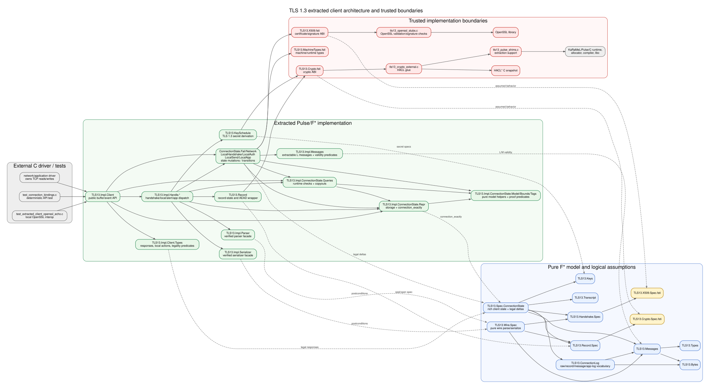

# TLS 1.3 client functional-correctness plan

## Problem and target

The repository already contains an extractable TLS 1.3 client plus a growing set of pure specifications. The goal is to prove the client functionally correct for the profile described in `TLS_OUTLINE.md`: TLS 1.3, X25519, ChaCha20-Poly1305, the existing supported handshake path, 1-RTT application data, and OpenSSL interoperability.

The proof should follow the `calc_sample` methodology:

- define a pure mathematical model of wire data, protocol messages, and state transitions;
- expose extractable low-level interfaces whose pre/postconditions connect C/F*/Pulse implementations to the pure model;
- maintain a monotonic ghost log that connects raw input/output buffers to TLS records, TLS messages, state-machine events, and the projected application-level transcript;
- state the top-level client API theorem in terms that callers can use, not in terms of implementation internals.

The main proof obligation is not merely phase progress or memory safety. The first implementation milestone targets a buffer-oriented verified core, not direct socket operations. Each successful core request consumes explicit network/application input buffers, updates the client state, and returns explicit network/application output buffers. The external driver is responsible for connecting those buffers to network IO. For every successful core operation, the input/output buffers should parse/decrypt into TLS messages whose pure state-machine trace is valid, and the operation's visible result should be exactly the application-log projection of that trace.

## Current state

Relevant existing structure:

- `TLS_OUTLINE.md` defines the desired architecture: pure `M` datatypes, low-level `L` datatypes, spec parsers/serializers, high-level transition relation, abstract crypto/X509 specs, layered log consistency, a top-level API, and a network-driver separation.
- `calc_sample/` is the reference pattern. Its log ties input bytes, parsed requests, serialized responses, and pure state-machine execution into one `log_consistent` predicate, then the server implementation proves each request processing step preserves that relation.
- `src/spec/TLS13.Wire.Spec.*` already contains pure parsing/serialization for records and several handshake messages.
- `src/spec/TLS13.StateMachine.fst` already defines TLS phases, host events, transition steps, and multi-step traces.
- `src/spec/TLS13.ConnectionLog.fst` already defines layered views: raw IO, stream view, TLS messages, TLS records, host events, application log, and a `connection_view_consistent` predicate. This should be adapted so the raw layer is the buffer history of the verified core.
- `src/impl/TLS13.Connection.fsti` exports the current socket-shaped client API. It now exposes a proof-facing `connection_exactly` predicate with an explicit `ConnectionLog.connection_view`; application read/write/close operations prove an existential `ConnectionLog.step` witness, while connect still needs the handshake transcript proof before it can expose the same theorem shape.
- `src/impl/TLS13.Connection.Core.fsti` / `.fst` now introduces the first buffer-oriented application-phase proof boundary. Its concrete buffer/request/response predicates and `process_request` theorem use explicit `network_in`, `app_in`, `network_out`, and `app_out` arrays and return a `ConnectionLog.step` witness. Handshake start is deliberately excluded. Application writes and close_notify now install/use the local application record-state boundary and emit sealed TLS records into `network_out`, threading exactly that output prefix into the raw sent log before proving the corresponding `ConnectionLog.step`: close_notify emits one record, while application writes generally use the recursive fragmentation helper over 16 KiB record chunks. `StateMachine.SendApplicationData` remains one logical host/app event, but advances the abstract write record sequence by the 16 KiB Core fragmentation count, so multi-record writes preserve one app-log entry while consuming multiple record nonces. The core also owns a peer application record state and key-install boundary for the read path, and `is_client_core` couples the concrete local/peer record sequence numbers to the abstract write/read record states while the connection remains non-failed. Reads thread explicit `network_in` into the raw received log, return `NeedNetworkInput` for short/incomplete input, copy those incomplete raw bytes into a heap pending-input buffer tracked by `ConnectionLog.connection_view.pending_received_raw`, decrypt one complete peer application record when available directly in `network_in` or as the first complete record assembled in the pending raw-input buffer, return the caller-accepted plaintext prefix in `app_out`, buffer any leftover plaintext for later reads, track those pending bytes in `ConnectionLog.connection_view.pending_app`, and map close_notify/known alerts into the corresponding `ConnectionLog` responses. Coalesced extra-record processing remains future work; for now, coalesced trailing raw bytes from either direct input or an already-pending raw buffer are preserved in `pending_received_raw` while returning the first parsed record's status.
- `src/impl/TLS13.Connection.fst` stores a monotonic `TLS13.State.log_ref`; the explicit log-update admits have been discharged, application-data and close_notify send/receive paths now thread actual raw socket bytes through `view.raw_log.raw_sent` and `view.raw_log.raw_received`, while several handshake events are still abstract witnesses rather than a full transcript proof.
- `src/impl/TLS13.Handshake.*`, `TLS13.Record.*`, `TLS13.Crypto.*`, and `TLS13.X509.*` contain the likely implementation/proof boundaries.
- The extracted OpenSSL echo smoke test currently treats `Connection.External.client_connect` as a trusted TLS transport boundary: the C backend performs the OpenSSL handshake, then carries the extracted record-layer bytes as TLS application data. This keeps extraction/runtime wiring exercised, but it is not the final verified handshake transcript theorem or a raw-TCP interoperability proof for the verified record layer.

Main gaps found during inspection:

- `TLS13.ConnectionLog.raw_tls` is currently too weak: it mostly checks stream shape, not the full relationship from raw bytes to parsed records, decrypted handshake/application messages, state-machine events, and app-log projection.
- `TLS13.Connection.Core` now provides a `process_request`-style core theorem for application-phase buffers. The send and close paths are connected to record/framing code, with concrete record sequence state linked to the abstract write-state sequence before and after each step. Application writes generally use recursive 16 KiB fragmentation, while still proving one logical `SendApplicationData` step whose abstract write state advances by the concrete record count. The legacy socket-shaped path still chunks writes at 4096 bytes and is intentionally not the final record-state-coupled proof boundary. Reads consume explicit `network_in` into the raw received log, decrypt one complete peer application record from direct input or from the first complete record in the pending raw buffer, link the concrete peer record sequence to the abstract read-state sequence on non-failed paths, deliver a prefix into `app_out`, buffer leftover plaintext, drain that pending plaintext on later reads using an app-log-only delivery event, keep the heap pending buffer tied to `connection_view.pending_app`, store short/incomplete raw input in a heap buffer tied to `connection_view.pending_received_raw`, clear that pending raw view after exact-complete consumption, preserve coalesced trailing raw bytes in `pending_received_raw` while returning the first parsed record's status, map close_notify to `Closed`, and map known TLS alerts to `Failed (AlertError ...)`. Processing coalesced extra records in the same call is still pending.
- `TLS13.Connection.fst` now verifies without local `admit()` calls, using layered log-update lemmas and concrete state/log transitions.
- `TLS13.Parser.Correctness.fst`, `TLS13.Handshake.Framing.fst`, and `TLS13.Record.Framing.fst` now discharge the scoped parser/framing correspondence lemmas used by the implementation.
- `TLS13.Handshake.fst` currently advances through dummy handshake events rather than proving that generated/parsing code produces the corresponding pure protocol events.
- `TLS13.IO.fsti` models channels operationally; the verified core should avoid depending on it directly. A thin external driver should translate socket reads/writes into core request/response buffers.

## Scoped TLS profile and representation rules

The proof target is intentionally narrower than full RFC 8446. The in-scope
profile is:

- client mode only;
- TLS 1.3 1-RTT handshake and application data;
- X25519 key exchange;
- `TLS_CHACHA20_POLY1305_SHA256`;
- no PSK, no 0-RTT, no resumption, no client authentication, and no key update.

The model/implementation split follows `TLS_OUTLINE.md`:

- pure message types `M` describe records, handshake messages, alerts, and
  application events using mathematical bytes and unbounded spec-level values;
- low-level implementation types `L` are extraction-shaped, using machine
  integers and Pulse-owned `array U8.t`/heap buffers for variable-length data;
- parser and serializer interfaces relate concrete arrays and lengths to the
  pure `M` parser/serializer functions;
- the current implementation may keep C-backed parser/serializer code behind
  strong `.fsti` contracts, with EverParse as the preferred future replacement;
- crypto behavior is specified by abstract F* functions and implemented through
  the HACL* C snapshot; certificate validation and peer-signature checks are
  specified abstractly and currently implemented through OpenSSL-backed code.

## Source map and architecture

The current source tree has these main proof and runtime areas:

| Area | Files/modules | Role |
| --- | --- | --- |
| Pure byte and TLS types | `src/spec/TLS13.Bytes.fst`, `TLS13.Types.fst` | Spec-level byte sequences and TLS constants/enums. |
| Wire model | `src/spec/TLS13.Wire.Spec.*` | Pure scoped parse/serialize model for records and supported handshake messages. |
| Crypto/X509 specs | `TLS13.Crypto.Spec.fsti`, `TLS13.X509.Spec.fsti` | Logical assumptions for crypto, certificate validation, and peer signatures. |
| Transcript, keys, records, handshake | `TLS13.Transcript`, `TLS13.Keys`, `TLS13.Record.Spec`, `TLS13.Handshake.Spec` | Pure functional models used by implementation postconditions. |
| State machine | `TLS13.StateMachine*` | Pure phase/event/trace model for the supported client profile. |
| Layered log | `TLS13.ConnectionLog` | Ghost vocabulary tying raw buffers to records, messages, host trace, state, and application projection. |
| Implementation support | `TLS13.State`, `TLS13.MachineTypes`, `TLS13.*StateDriver` | Extraction-shaped state and proof/control-flow support. |
| Trusted runtime ABIs | `TLS13.Crypto.fsti`, `TLS13.X509.fsti`, `TLS13.IO.fsti`, `TLS13.Connection.Backend.fsti`, `c_stubs/*` | Boundaries for primitives, OpenSSL, sockets, backend lifetime, and runtime shims. |
| Verified protocol implementation | `TLS13.KeySchedule`, `TLS13.Record*`, `TLS13.Handshake*`, `TLS13.Connection*` | Current extracted client implementation to be adapted to the buffer-oriented core theorem. |
| Tests | `test/`, `scripts/test-openssl-echo.sh` | C binding tests and controlled OpenSSL interop smoke tests. |

The architecture diagram is kept as `arch.svg`, with editable source in
`arch.dot`. Regenerate it with:

```sh
dot -Tsvg arch.dot -o arch.svg
```



## Trusted boundaries and current proof debt

The canonical proof goal is admit-free functional correctness for the
buffer-oriented core. The current source tree has no explicit `admit()` sites
under `src/` or `calc_sample/` according to `make check-admits`. The former
connection-log, parser-correctness, handshake-framing, and record-framing admits
have been discharged against the scoped TLS profile.

The runtime TCB is separate from explicit proof admissions:

- F*, Pulse, KaRaMeL, the generated C toolchain, allocator, and platform C
  libraries are trusted infrastructure.
- HACL*/backend crypto bindings are trusted for primitive behavior matching
  `TLS13.Crypto.Spec`.
- OpenSSL-backed certificate validation and signature verification are trusted
  for behavior matching `TLS13.X509.Spec`.
- Socket I/O and backend lifetime/handle management are trusted at the driver
  boundary. The verified core should only rely on explicit byte buffers; the
  external driver is responsible for relating those buffers to actual network
  reads and writes.
- The current extracted OpenSSL echo backend is additionally trusted for the
  external `client_connect` handshake boundary and TLS transport tunnel. This is
  a runtime smoke-test bridge until `TLS13.Connection.fst` replaces dummy
  handshake witnesses with evidence derived from the actual ClientHello/server
  transcript.

The parser/framing TCB should remain narrow: low-level parser postconditions
must reference `TLS13.Wire.Spec` directly, and any remaining assumed parser fact
must state both success/failure correspondence and extracted-field equality.

## Extraction and KaRaMeL notes

Extraction currently uses existing Makefile targets. `make extract-bundle`
extracts the TLS implementation while hiding standard-library/Pulse modules and
using a multi-file or lightly bundled layout for the complex TLS modules.

A historical KaRaMeL issue was observed when trying to force the full TLS
implementation into a single API bundle: KaRaMeL raised `Failure("nth")` during
pattern-match compilation for bundles involving complex modules such as
`TLS13.Handshake*`, `TLS13.Record*`, or `TLS13.KeySchedule`. A small synthetic
reproduction did not reliably trigger the issue, so the actionable project fact
is only this: the current extraction plan should not depend on a single-file
bundle until the full TLS bundle works again or the KaRaMeL issue has a stable
upstream reproduction.

Extraction is not the proof boundary. The proof boundary is the Pulse/F*
interface of the buffer-oriented core; extraction tests validate that the
verified implementation remains operational after translation to C.

## Validation workflow

Use the existing repository commands:

```sh
# one-time setup
git submodule update --init --depth 1 third_party/hacl-star
./setup.sh
scripts/fetch-rfcs.sh
scripts/check-openssl.sh

# full F*/Pulse verification
make verify

# extract the current C artifacts
make extract-bundle

# local C binding and extraction smoke tests
make test

# controlled OpenSSL TLS 1.3 echo interop
make test-openssl-echo
```

The `make test` target covers verification, C stub syntax, HACL*/OpenSSL/I/O
stub tests, extraction smoke tests, and extracted binding tests. The
`test-openssl-echo` target runs the local OpenSSL TLS 1.3 echo scenario with the
repository's extracted client path. The test tree contains:

- `test/tls_client.c` for the end-to-end client demonstration;
- `test/openssl_echo_server.c` for the local interop server;
- `test/unit/` for component and binding tests.

For the calc methodology reference, use:

```sh
cd calc_sample
make verify
make check-admits
make test-c
```

## Research context

The intended contribution is a reusable Pulse methodology for stateful protocol
verification:

- a pure wire/message/state model;
- extraction-shaped low-level implementations whose interfaces expose
  functional-correctness postconditions;
- a monotonic layered ghost log connecting raw bytes to protocol state and
  caller-visible application data;
- a top-level `process_request` theorem that callers can use without reasoning
  about implementation internals.

Claims should stay tied to the actual proof state. Even with explicit admits
eliminated, the repository should be described as a verified implementation for
the scoped profile and stated TCB, not as a full RFC 8446 or production-ready
TLS implementation.

## Proposed approach

### 1. Fix the proof target and public theorem shape

Define the functional-correctness contract before changing implementation code:

- identify the exact proof-facing API surface: a `process_request`-style function over explicit request and response buffers;
- define the observable result for each operation in terms of `ConnectionLog.app_log`;
- decide which failure cases are in scope: parse failure, alert/close_notify, certificate failure, unsupported cipher/group, IO failure;
- keep the theorem tied to the supported TLS profile from `TLS_OUTLINE.md`, not full RFC 8446.

Expected deliverable:

- strengthened `.fsti` specifications for the buffer-oriented verified core, plus a separate driver-facing wrapper if the current socket API remains operationally convenient;
- this design file as the authoritative implementation plan for the proof effort.

### 2. Complete the pure model layer

Harden the pure `M` model so every implementation proof has a stable spec target:

- review `TLS13.Types`, `TLS13.Wire.Spec`, `TLS13.Handshake.Spec`, `TLS13.Record.Spec`, `TLS13.Keys`, `TLS13.Transcript`, and `TLS13.StateMachine`;
- add missing pure event constructors or fields needed to represent the supported handshake precisely, including certificate validation, server finished, client finished, traffic-secret installation, application data, and close;
- add or expose parser/serializer round-trip and inversion lemmas for the supported record and handshake encodings;
- keep pure specs implementation-independent: byte sequences and mathematical values only, not Pulse arrays, machine integers, mutable buffers, or backend handles.

Expected deliverable:

- a pure state-machine trace model rich enough to account for the current client behavior;
- lemmas that connect pure wire parsing/serialization to pure messages and records.

### 3. Make the parser/framing TCB explicit and narrow

Follow the `TLS_OUTLINE.md` split between pure `M` functions and low-level `L` extractable code:

- strengthen `TLS13.Handshake.Framing.fsti` specs for ClientHello construction, ServerHello parsing, Certificate parsing, CertificateVerify parsing, Finished parsing, and handshake-message framing;
- strengthen `TLS13.Record.Framing.fsti` specs for record headers, inner plaintext encoding/decoding, application-data record construction, and alert/close_notify framing;
- keep existing C-backed parser/serializer implementations if needed, but state their assumptions precisely in the F* interfaces;
- use `TLS13.Parser.Correctness.fst` for proved parser-correctness lemmas where practical, and clearly mark any remaining external parser facts as TCB.

Expected deliverable:

- low-level parser/serializer interfaces whose postconditions reference `TLS13.Wire.Spec` functions directly;
- no success-shaped weak specs such as "returns some bytes" without a relation to the pure serializer/parser.

### 4. Strengthen crypto, X509, key schedule, and record correspondence

Ensure cryptographic and certificate operations have functional specs strong enough for the connection proof:

- audit `TLS13.Crypto.fsti` and `TLS13.X509.fsti` against `TLS13.Crypto.Spec` and `TLS13.X509.Spec`;
- strengthen runtime record APIs so encrypted record production/opening correspond to `TLS13.Record.Spec`, not just phase or buffer-shape facts;
- strengthen key-schedule/install APIs so installed read/write keys correspond to pure traffic secrets derived from the transcript;
- expose only abstract security assumptions needed for functional correctness, such as AEAD open inverts seal when keys/nonces/AAD match, certificate validation matches the abstract X509 predicate, and signature verification matches the abstract verification predicate.

Expected deliverable:

- a clear trusted boundary for HACL*/OpenSSL-backed code;
- record-layer specs usable by the handshake and application-data proofs.

### 5. Redesign `ConnectionLog` into the central layered invariant

Make `TLS13.ConnectionLog` the calc-style proof spine:

- refine raw logs into directional buffer histories for bytes accepted from and emitted by the verified core;
- define deterministic or relational parsing from raw inbound/outbound bytes to TLS records;
- define decryption/interpretation from records to TLS messages and application bytes, parameterized by the relevant handshake/application keys;
- connect TLS messages to `TLS13.StateMachine.host_event` traces;
- define application projection in one place and prove projection lemmas for send, receive, close, and failure cases;
- add append/preservation lemmas analogous to `calc_sample` single-step log lemmas.

Expected deliverable:

- a strong `connection_view_consistent` predicate that proves raw bytes, TLS messages, state-machine trace, and app-log view agree;
- update lemmas for each operation so `TLS13.Connection.fst` does not need local admits to advance the ghost log.

### 6. Design the buffer-oriented verified core API

Do not make live network IO the proof boundary. Instead, revise the top-level verified API to follow the `calc_sample` shape: one request/response function consumes an explicit input buffer, updates the TLS client state, and produces an explicit output buffer. A separate unverified or lightly specified driver owns blocking socket reads/writes, retries, fragmentation, and OpenSSL interop orchestration.

The proof-level request and response datatypes should make the two byte directions explicit:

```fstar
type client_operation =
  | OpStart of server_name: hostname
  | OpSendApplicationData of plaintext: bytes
  | OpReadApplicationData of max_len: nat
  | OpClose

type client_request = {
  operation: client_operation;
  network_in: bytes;  // bytes supplied by the driver from the socket
}

type client_status =
  | NeedNetworkInput
  | HandshakeComplete
  | ActionComplete
  | ApplicationDataReady
  | Closed
  | Failed of error_code

type client_response = {
  network_out: bytes;  // bytes the driver must write to the socket
  app_out: bytes;      // plaintext bytes delivered to the caller
  status: client_status;
}
```

The proof-facing implementation interface should use Pulse signatures. The pure datatypes above describe the mathematical request and response; the Pulse signature exposes concrete buffers, ownership, and the pure correspondence in its pre/postconditions:

```fstar
module TLS13.Client.Core

#lang-pulse

open Pulse.Lib.Pervasives
open Pulse.Lib.Array.PtsTo

module B = TLS13.Bytes
module CL = TLS13.ConnectionLog
module SZ = FStar.SizeT
module U8 = FStar.UInt8

val client_core : Type0

val is_client_core :
  client_core -> CL.connection_view -> slprop

type request_kind =
  | KStart
  | KSendApplicationData
  | KReadApplicationData
  | KClose

type core_status =
  | NeedNetworkInput
  | HandshakeComplete
  | ActionComplete
  | ApplicationDataReady
  | Closed
  | Failed

type core_result = {
  network_out_len: SZ.t;
  app_out_len: SZ.t;
  status: core_status;
}

val request_buffers_match :
  request_kind ->
  network_in:B.bytes ->
  app_in:B.bytes ->
  requested_app_len:nat ->
  client_request ->
  Type0

val response_buffers_match :
  core_result ->
  network_out_buffer:B.bytes ->
  app_out_buffer:B.bytes ->
  client_response ->
  Type0

fn process_request
  (c: client_core)
  (kind: request_kind)
  (network_in: array U8.t)
  (network_in_len: SZ.t)
  (app_in: array U8.t)
  (app_in_len: SZ.t)
  (requested_app_len: SZ.t)
  (network_out: array U8.t)
  (network_out_cap: SZ.t)
  (app_out: array U8.t)
  (app_out_cap: SZ.t)
  (#view0: erased CL.connection_view)
  (#mreq: erased client_request)
requires
  is_client_core c view0 **
  pts_to network_in 'network_in_bytes **
  pts_to app_in 'app_in_bytes **
  pts_to network_out 'network_out0 **
  pts_to app_out 'app_out0 **
  pure (
    B.length 'network_in_bytes == SZ.v network_in_len /\
    B.length 'app_in_bytes == SZ.v app_in_len /\
    B.length 'network_out0 == SZ.v network_out_cap /\
    B.length 'app_out0 == SZ.v app_out_cap /\
    request_buffers_match
      kind 'network_in_bytes 'app_in_bytes (SZ.v requested_app_len) mreq
  )
returns r: core_result
ensures
  exists* view1 network_out1 app_out1 mresp.
  is_client_core c view1 **
  pts_to network_in 'network_in_bytes **
  pts_to app_in 'app_in_bytes **
  pts_to network_out network_out1 **
  pts_to app_out app_out1 **
  pure (
    B.length network_out1 == SZ.v network_out_cap /\
    B.length app_out1 == SZ.v app_out_cap /\
    SZ.v r.network_out_len <= SZ.v network_out_cap /\
    SZ.v r.app_out_len <= SZ.v app_out_cap /\
    response_buffers_match r network_out1 app_out1 mresp /\
    CL.step view0 mreq view1 mresp
  )
```

The concrete Pulse parameters are intentionally buffer-oriented:

- `network_in` contains bytes read by the external driver from the socket and is available to every operation; it is typically empty for writes/closes and non-empty when a read or handshake step must process inbound TLS records;
- `app_in` contains plaintext supplied by the caller and is meaningful for `KSendApplicationData`;
- `requested_app_len` is meaningful for `KReadApplicationData`;
- `network_out` is mutated with the TLS bytes the driver must write to the socket;
- `app_out` is mutated with plaintext bytes delivered to the caller;
- `core_result` reports how many bytes in each output buffer are valid and the next driver action.

The `request_buffers_match` and `response_buffers_match` predicates are the spec/implementation bridge. They relate concrete Pulse buffers and machine-sized lengths to the pure `client_request` and `client_response` values, while `CL.step` records exactly which inbound network bytes were consumed, which outbound network bytes were produced, which plaintext bytes were accepted or returned, and which TLS state-machine events justify the transition. The core copy helpers now prove copied destination slices equal the corresponding source slices, so read-path app and pending buffers are tied directly to decrypted plaintext prefixes/suffixes.

The external driver should be a thin orchestration layer:

- call `OpStart` requests, feeding any available `network_in`, and write `network_out` to the socket;
- pass caller writes as `OpSendApplicationData`, usually with empty `network_in`, and write the returned `network_out`;
- satisfy caller reads with `OpReadApplicationData`, feeding newly read socket bytes through `network_in` until the core returns `ApplicationDataReady`, `NeedNetworkInput`, `Closed`, or `Failed`;
- call `OpClose` and write any returned close_notify bytes.

Expected deliverable:

- a new or revised proof-facing module, for example `TLS13.Client.Core.fsti`, exposing `client_core`, `client_request`, `client_response`, and `process_request`;
- a driver module, for example `TLS13.Client.Driver.fst`, that adapts the existing `TLS13.IO` socket operations to the core buffers;
- a top-level theorem for `process_request` rather than for direct IO operations.

### 7. Refactor/prove handshake correctness

Replace dummy handshake events with evidence derived from actual generated and parsed data:

- prove ClientHello bytes serialize the pure ClientHello event added to the trace;
- prove each received server handshake message parses from raw bytes into the corresponding pure event;
- prove certificate validation and CertificateVerify checks generate the right pure state-machine events;
- prove Finished verification and key installation correspond to transcript and key-schedule specs;
- connect the full connect operation to a valid trace from `Start` to `ApplicationData`.

Expected deliverable:

- the `OpStart` handshake sequence, with explicit `network_in` bytes, proves a valid handshake trace and establishes application traffic keys;
- dummy handshake witnesses are removed or isolated behind explicit TCB specs.

### 8. Prove application data and close correctness

Once the handshake invariant is established:

- prove `OpSendApplicationData` appends exactly the accepted plaintext bytes to the outbound app-log projection and returns exactly the encrypted network buffer that the driver must send;
- prove `OpReadApplicationData` accounts for exactly the inbound `network_in` bytes, returns exactly a prefix of available plaintext, and preserves projection correctness when one TLS record satisfies multiple reads;
- prove `OpClose` emits or accepts close_notify consistently with the state-machine trace and final phase;
- specify and prove behavior for EOF, alert, parse failure, and decryption failure within the chosen scope.

Expected deliverable:

- exported buffer-request postconditions that callers and the external driver can use to reason about application-level behavior.

### 9. Separate verified core from network driver and extraction

Keep the top-level proof boundary clean:

- make the `process_request`-style API the verified core boundary;
- keep the network loop/driver as an orchestration layer that relies on the verified core theorem and only proves or assumes that bytes written/read from the socket equal the core's `network_out`/`network_in` buffers;
- preserve existing extraction and OpenSSL interop paths;
- document which C-backed functions are trusted and which F* lemmas prove correspondence.

Expected deliverable:

- a caller-facing verified buffer core and a driver that remains easy to test against OpenSSL.

### 10. Validation and admission tracking

Use existing repository commands only:

- run targeted F* verification for changed modules during implementation;
- run `make verify` for full F*/Pulse verification;
- run the existing tests and OpenSSL interop targets for extracted behavior;
- keep an admit-count gate or `check-admits` equivalent so each phase reduces the current proof debt rather than moving admits around.

Expected deliverable:

- all changed modules verify;
- extracted client continues to pass existing local and OpenSSL interoperability tests;
- remaining TCB/admit surface is explicit and justified.

## Work items

1. Define the top-level correctness target and buffer-oriented public API theorem.
2. Complete the pure TLS profile model and expose needed wire/state-machine lemmas.
3. Strengthen parser, serializer, and framing interfaces against pure wire specs.
4. Strengthen crypto, X509, key-schedule, and record-layer correspondence specs.
5. Rework `TLS13.ConnectionLog` into the central layered log invariant.
6. Design the buffer-oriented verified core and external network driver boundary.
7. Prove handshake correctness for `OpStart` requests with explicit `network_in` from actual bytes and messages.
8. Prove application send/receive/read/close correctness and app-log projection for buffer requests.
9. Keep the verified core separate from the network driver and document the TCB.
10. Add validation/admit-count workflow using existing verification and interop commands.

## Notes and risks

- The chosen first milestone is a full theorem for the buffer-oriented `process_request` API. Internally, implementation can still proceed incrementally through handshake, application data, and close phases, but the plan should not stop at handshake-only correctness.
- Parser/framing correctness is likely to remain partially trusted if the C implementations stay external. The plan should make this a narrow, named TCB rather than hiding it behind weak postconditions.
- Certificate validation, transcript hashing, Finished verification, and traffic-secret installation must be represented in the pure state trace. Otherwise the proof would only show phase progress, not functional correctness of TLS authentication.
- Pending read buffers are easy to underspecify. The app-log projection must account for splitting one decrypted TLS record across multiple `OpReadApplicationData` calls.
- The proof should avoid exposing implementation-specific predicates in `.fsti` files unless accompanied by spec-level projection lemmas.
